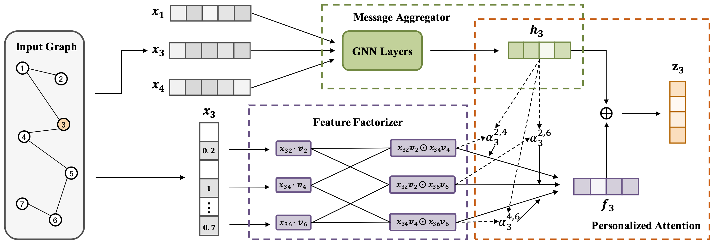

# Feature Interaction-aware Graph Neural Networks

This repository is the official implementation of Feature Interaction-aware Graph Neural Networks. 

The sketches of FI-GNN model structure. 



## Requirements

To install requirements:

```setup
pip install -r requirements.txt
```

## Training
You can train on four different datasets (BlogCatalog, Flickr, ACM, DBLP) by changing the parameters of **data_name**. You can also train three different GNNs (gcn, SimpleGCN, graphsage) by changing **model_type** 

###  Semi-supervised Node Classification

- Training FI-GCN in node classification
```shell script
cd FI_GCN
python train.py --supervised \
--epochs 200 \
--hidden 32 \
--lr 1e-3 \
--truncate_size 200 \
--model_type gcn \
--data_name BlogCatalog \
--output_file \path\to\output\file \
--weight_decay 5e-4 \
--dropout 0.2 
```
- Training FI-GraphSAGE in node classification 
```shell script
cd FI_GraphSAGE_SimpleGCN
python graphsage_classification.py \
--num-hidden 32 \
--lr 0.001 \
--dropout 0.2 \
--data_name BlogCatalog \
--output_file \path\to\output\file
```

- Training FI-SimpleGCN in node classification
```shell script
cd FI_GraphSAGE_SimpleGCN
python simple_gcn_classification.py \
--num-hidden 32 \
--lr 0.001 \
--data_name BlogCatalog \
--output_file \path\to\output\file
```

### Unsupervised Link Prediction

- Training FI-GCN in link prediction

```shell script
cd FI_GCN
python train.py
--epochs 200 \
--hidden 32 \
--lr 1e-3 \
--truncate_size 200 \
--model_type gcn \
--data_name BlogCatalog \
--output_file \path\to\output\file \
--weight_decay 5e-4 \
--dropout 0.2 
```

- Training FI-GraphSAGE in link prediction
```shell script
cd FI_GraphSAGE_SimpleGCN 
python link_prediction.py
--epochs 200 \
--hidden 32 \
--lr 1e-3 \
--truncate_size 200 \
--model_type graphsage \
--data_name BlogCatalog \
--output_file \path\to\output\file \
--weight_decay 5e-4 \
--dropout 0.2 
```

- Training FI-SimpleGCN in link prediction
```shell script
cd FI_GraphSAGE_SimpleGCN 
python link_prediction.py
--epochs 200 \
--hidden 32 \
--lr 1e-3 \
--truncate_size 200 \
--model_type simplegcn \
--data_name BlogCatalog \
--output_file \path\to\output\file \
--weight_decay 5e-4 \
--dropout 0.2 
```
 
- Hyper-parameter search

We use grid search in our node classification task. You can check the **parameter_search.sh** as an example for gcn. 

The hyper-parameters setting for these models are as follows:

| Hyper-Parameter    | Search Space    | 
| ------------------ |---------------- |
| learning rate: **lr** |  **gcn, SimpleGCN**:{0.01, 0.001, 0.005}, **graphsage**:{0.01, 0.001}|
| hidden dimension: **hidden** | **gcn, graphsage, SimpleGCN**:{32, 32} |
| dropout ratio: **dropout** | **gcn, graphsage, SimpleGCN**:{0.2 0.5}|
| weight decay (l2 loss): **weight_decay** | **gcn, SimpleGCN, graphsage**:{5e-3, 5e-4}|
 


 
## Evaluation
By setting the **output_file** in the previous step, you can find the test result in _\path\to\output\file_. 


